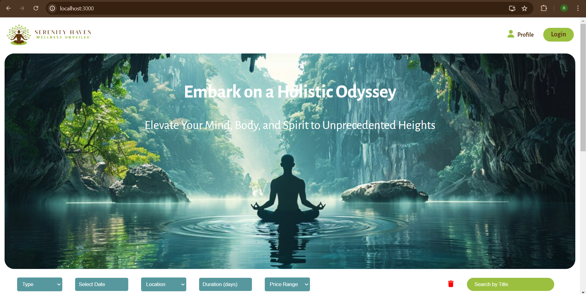
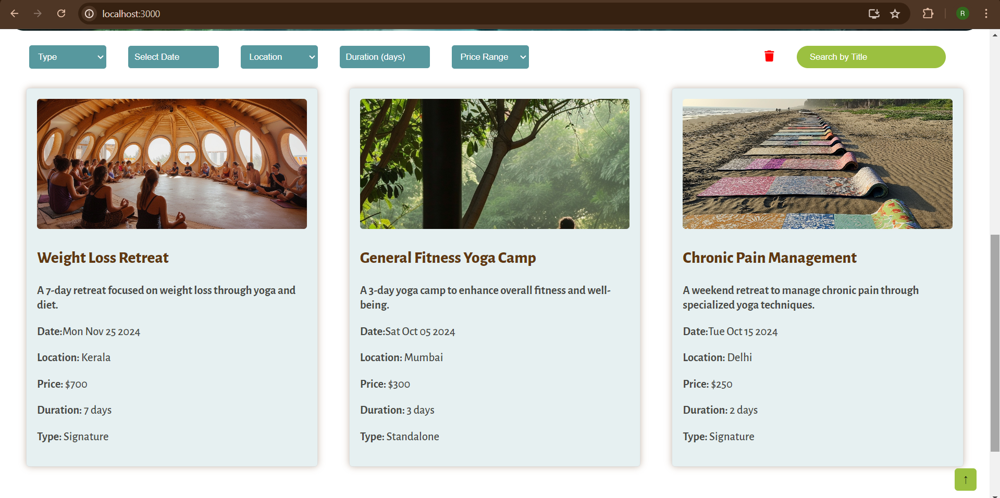
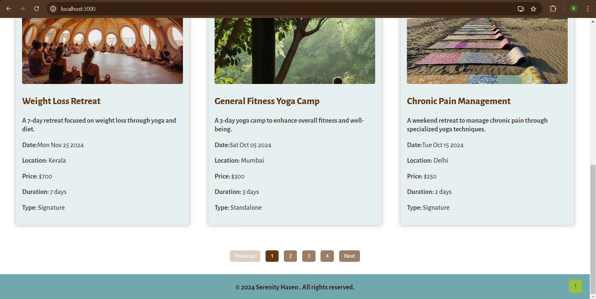
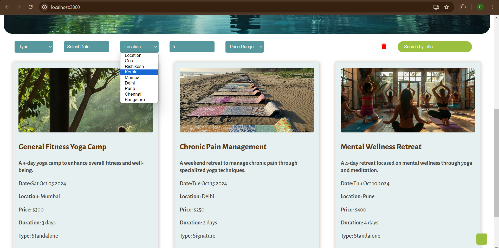
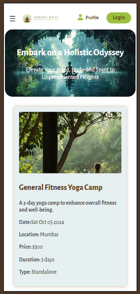
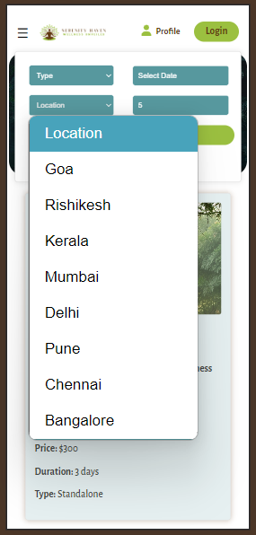
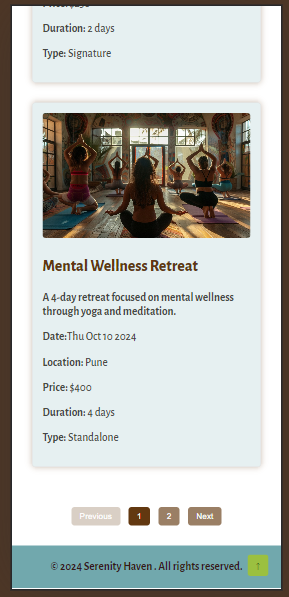

# Serenity Haven

Serenity Haven is a React application that helps users find and filter wellness retreats based on various criteria such as type, date, location, price, and duration.

## Table of Contents

- [Installation](#installation)
- [Usage](#usage)
- [Features](#features)
- [Technologies](#technologies)
- [Screenshots](#screenshots)
- [Contributing](#contributing)
- [License](#license)
- [Live Website](#live-website)

## Installation

### Prerequisites

- Node.js and npm installed on your machine. You can download them from [Node.js](https://nodejs.org/).

### Steps

1. Clone the repository:
   ```sh
   git clone https://github.com/your-username/welness-app.git
   ```

2. Navigate to the project directory:
   ```sh
   cd welness-app
   ```

3. Install the dependencies:
   ```sh
   npm install
   ```

## Usage

### Running the Application

1. Start the development server:
   ```sh
   npm start
   ```

2. Open your browser and navigate to `http://localhost:3000` to see the application running.

### Building for Production

1. Build the application for production:
   ```sh
   npm run build
   ```

2. The production-ready files will be in the `build` directory.

## Features

- Filter retreats by type, date, location, price, and duration
- Responsive design for mobile and desktop views
- Paginated list of retreats
- Scroll to top button for easy navigation
- User can login

## Technologies

- React
- CSS
- HTML

## Screenshots

### Home Page


### Cards Page


### Footer


### Filter Options


### Responsive


## Contributing

Contributions are welcome! Please follow these steps:

1. Fork the repository.
2. Create a new branch: `git checkout -b feature/your-feature`.
3. Make your changes and commit them: `git commit -m 'Add some feature'`.
4. Push to the branch: `git push origin feature/your-feature`.
5. Open a pull request.

## License

This project is licensed under the MIT License. See the [LICENSE](license) file for details.

## Live Website

You can access the live version of the application [here](https://jainrishabh2304.github.io/Shoonya-assignment/).

